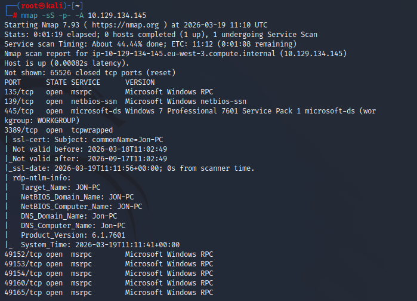
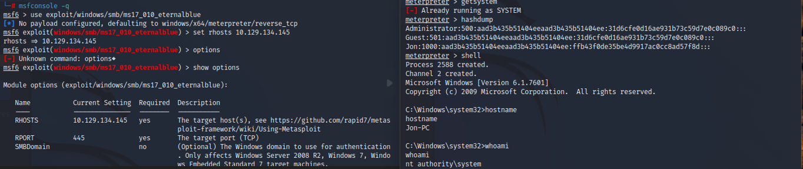
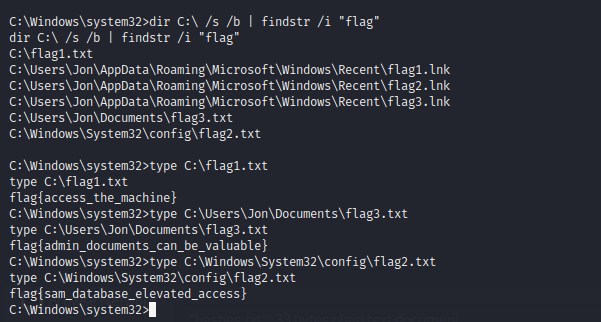

# Windows Exploitation Report
## TryHackMe – Blue (EternalBlue)

## Analyst
Security Analyst Trainee

---

# 1. Objective

The objective of this assessment was to identify vulnerabilities in a Windows host and exploit them to gain unauthorized access and retrieve sensitive information.

---

# 2. Target Information

Target IP:
10.129.134.145

---

# 3. Reconnaissance and Scanning

An initial scan was performed using:

nmap -sS -p- -A 10.129.134.145

### Evidence

### Key Findings

Open Ports:

- 135/tcp – MSRPC  
- 139/tcp – NetBIOS  
- 445/tcp – SMB  
- 3389/tcp – RDP  
- Multiple high RPC ports  

System Details:

- Windows 7 Professional SP1  
- SMB message signing disabled (security weakness)  

---

# 4. Vulnerability Identification

The presence of SMB (port 445) on a Windows 7 system indicated potential exposure to the : MS17-010 EternalBlue.

This vulnerability allows remote code execution through specially crafted SMB packets and has been widely exploited in real-world attacks, including large-scale ransomware campaigns.

---

# 5. Exploitation

The target was confirmed vulnerable to MS17-010.

The vulnerability was exploited to gain access to the system and retrieve password hashes from memory.

### Evidence

---

# 6. Credential Access

Password hashes were extracted from the system.

Findings:

- Two accounts had **empty passwords**
- One account (`jon`) had a hashed password

The hash was cracked using **:contentReference[oaicite:1]{index=1}**.

Commands used:

hashcat -m 1000 -a 0 hashes.txt rockyou.txt  
hashcat --show hashes.txt  

Recovered credentials:

Username: jon  
Password: alqfna22  

---

# 7. Post-Exploitation

Using the recovered credentials, further access to the system was achieved.

Sensitive directories were explored to locate flags and important files.

Common locations included:

- User Desktop directories  
- Documents folders  
- System directories  

### Evidence

---

# 8. Indicators of Compromise (IOCs)

### Vulnerability

MS17-010 (EternalBlue)

---

### Weak Credentials

- Accounts with empty passwords  
- Cracked credentials: jon : alqfna22  

---

### Services Exposed

- SMB (445)  
- RDP (3389)  

---

# 9. Attack Path Summary

1. Performed full port scan using Nmap  
2. Identified SMB service on Windows 7 system  
3. Discovered MS17-010 vulnerability  
4. Exploited EternalBlue to gain access  
5. Extracted password hashes  
6. Cracked hashes using Hashcat  
7. Used credentials to access the system  
8. Retrieved flags from sensitive locations  

---

# 10. Root Cause

The compromise was possible due to:

- Unpatched Windows system vulnerable to MS17-010  
- Weak password policies (empty passwords)  
- Exposure of SMB service to the network  

---

# 11. Recommendations

- Apply security patches to mitigate MS17-010  
- Disable or restrict SMB access  
- Enforce strong password policies  
- Disable accounts with empty passwords  
- Monitor SMB traffic for anomalies  
- Implement network segmentation  

---

# 12. Conclusion

The system was successfully compromised through exploitation of the EternalBlue vulnerability.

Weak credential practices further enabled access and post-exploitation activities.

This demonstrates how unpatched systems and poor credential management can lead to full system compromise.

---

# Screenshots

- nmap_scan.png  
- exploit.png
- metasploit.png
- meterpreter.png  
- flags.png  
