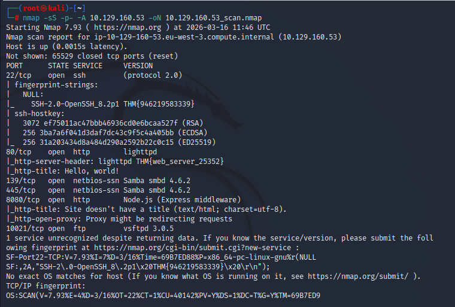
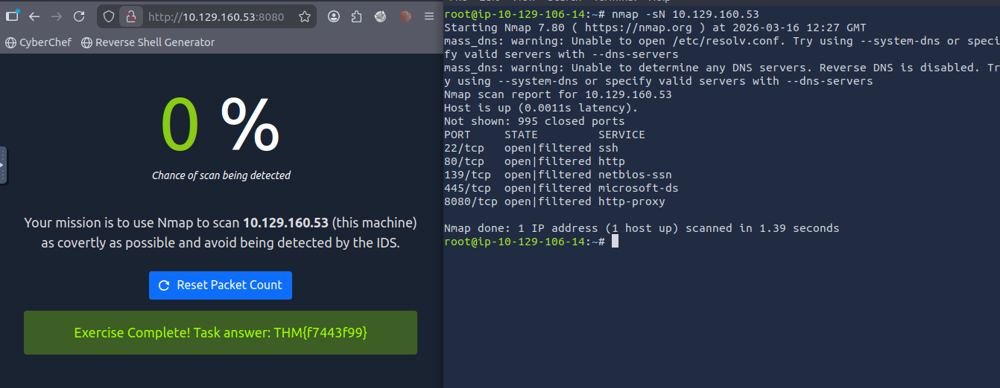
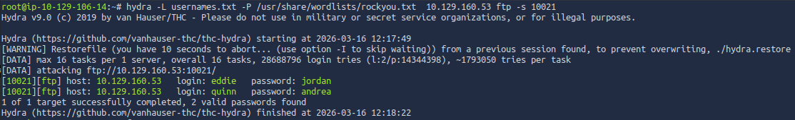
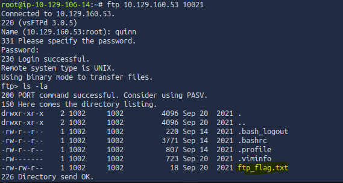

# Network Security Assessment Report
## TryHackMe – Net Sec Challenge

## Analyst
Security Analyst Trainee

---

# 1. Objective

The objective of this challenge was to assess the target host and identify open services using basic network security tools.  
The exercise required the use of only the following tools:

- Nmap
- Telnet
- Hydra

The goal was to enumerate the system, identify accessible services, discover misconfigurations, and retrieve flags exposed through those services.

Target IP:

10.129.160.53

---

# 2. Reconnaissance and Port Scanning

Initial reconnaissance was conducted using **Nmap** to discover open ports and services running on the target system.

Example command used:

nmap -sS -p- 10.129.160.53 -oN scan_results.nmap

This scan revealed multiple open ports and services running on the host.

### Evidence

### Open Ports Identified

22/tcp – SSH  
80/tcp – HTTP  
139/tcp – NetBIOS  
445/tcp – SMB  
8080/tcp – HTTP Proxy  
10021/tcp – FTP (Non-standard port)

A total of **6 TCP ports** were identified as open.

The highest open port below 10,000 was:

8080

An additional open port outside the common range was discovered:

10021

---

# 3. Service Enumeration

Further enumeration of the discovered services was performed using Nmap service detection.

The HTTP service on port **80** returned a server header containing a hidden flag.

Flag discovered:

THM{web_server_25352}

The SSH service on port **22** also revealed a flag embedded in the SSH fingerprint output.

Flag discovered:

THM{946219583339}

Nmap fingerprinting also revealed that the system is running a **Unix-based operating system**.

---

# 4. Web Service Enumeration

A web service was discovered running on port **8080**.

Accessing the service through a browser revealed a challenge interface that provided an additional flag once the scanning exercise was completed successfully.

Flag discovered:

THM{f7443f99}

### Evidence

---

# 5. Credential Attack on FTP Service

An FTP service was discovered running on a **non-standard port (10021)**.

Using information gathered through the challenge, two potential usernames were identified:

eddie  
quinn

A password brute-force attack was performed using **Hydra**.

Example command used:

hydra -L usernames.txt -P /usr/share/wordlists/rockyou.txt 10.129.160.53 ftp -s 10021

The attack successfully identified valid credentials.

Valid credentials discovered:

eddie : jordan  
quinn : andrea

### Evidence

---

# 6. FTP Enumeration

Using the discovered credentials, access to the FTP server was obtained.

Example command:

ftp 10.129.160.53 10021

After authenticating as user **quinn**, the directory contents were enumerated.

A file named:

ftp_flag.txt

was discovered in the user's directory.

The file contained the following flag:

THM{321452667098}

### Evidence

---

# 7. Indicators and Key Findings

Open Services Identified

22 – SSH  
80 – HTTP  
139 – NetBIOS  
445 – SMB  
8080 – HTTP Proxy  
10021 – FTP

Operating System

Unix-based system

Weaknesses Identified

- FTP service exposed on a non-standard port
- Weak credentials vulnerable to dictionary attack
- Sensitive information stored in publicly accessible FTP directory
- Flags embedded in service headers

---

# 8. Conclusion

The assessment successfully identified multiple open services on the target system and demonstrated how misconfigurations and weak credentials can expose sensitive information.

Through service enumeration and credential attacks, several hidden flags were discovered across different services including HTTP, SSH, FTP, and the challenge interface itself.

The exercise highlights the importance of proper service hardening, credential security, and minimizing unnecessary exposure of services to prevent unauthorized access.

---

# Screenshots

The following screenshots support the findings in this investigation:

- Nmap scan results  
- Hydra credential brute-force  
- FTP access and file discovery  
- Challenge interface completion  
- Answer verification
